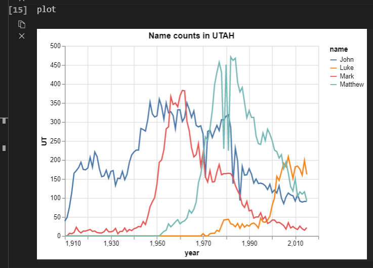
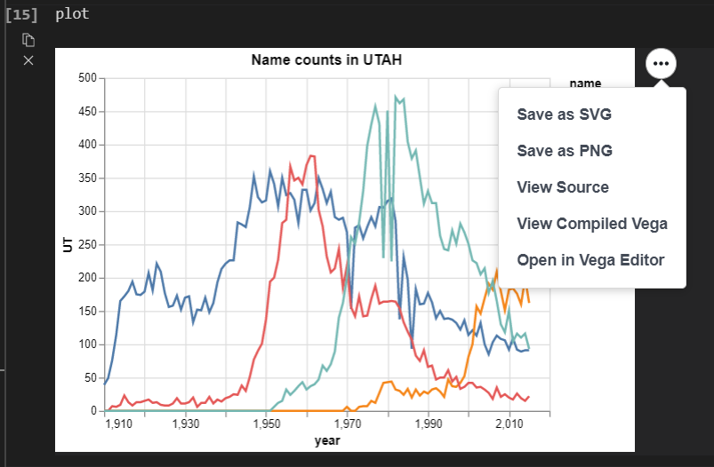

## Altair Visualization

We will be using Altair in our course. It is a declarative visualization package in Python that is based on Vega-Lite which leverages the grammar of graphics.

- [User Guide](https://altair-viz.github.io/)
- [Data Visualization Curriculum](https://github.com/uwdata/visualization-curriculum)
- [P4DS Data Visualization Chapter](https://byuidatascience.github.io/python4ds/data-visualisation.html)

## Saving Altair Charts

There are some complexities when saving Altair plots due to the use of Javascript in creating a local file for our chart. Specifically, when you save your charts as PNG, SVG, or pdf in a robust manner, just installing Altair and Altair_saver is not sufficient. We will go through a few ways for us to save our Altair plots.

The [YouTube: Altair: Saving .png charts (CSE 250)](https://www.youtube.com/watch?v=RqlCQdi6gg4) video is a good guide to supplement the text below.

### 1. A robust way of saving altair plots



Let's say we want to save the above plot as a PNG file. Assuming we have already installed the **altair** library, we need to install the **altair_saver**. 

#### 1.1 Installing the altair_saver

```
pip install altair_saver
```

#### 1.2 Additional tool for saving plots

The Github repository for [altair_saver](https://github.com/altair-viz/altair_saver), the developers exclusively told us to install additional tools. We would suggest using NodeJS for this class which is what we will be showing here. However, you are more than welcome to study [Selenium](https://github.com/altair-viz/altair_saver#selenium) for further understanding.

#### 1.2.1 Installing NodeJS

1. Install the [NodeJS](https://nodejs.org/en/download/package-manager/) for your platform
2. Run this line to install all the packages we need or NodeJS

```
npm install -g vega-lite vega-cli canvas
```

#### 1.3 Saving a plot using altair_saver

It might require you to restart VScode and import everything again for this to work. Please note that the plot will be saved in the same folder of the script.

```python
chart = alt.chart(<data>).<chart_methods>
chart.save('name_of_chart.png')
```

### 2. Not so robust way to save plots

The method only requires us to have **Altair** library. Whenever we output a plot, we will see a button with three dots at the top right corner of the plot.



Clicking *Save as PNG* will bring us to a window to save our plot.

### 3. Even less robust way to save plots

If all thing fails and we need to save a plot, the *snip & sketch* (Windows) or taking a screenshot (MacOS) will be our last resort.
