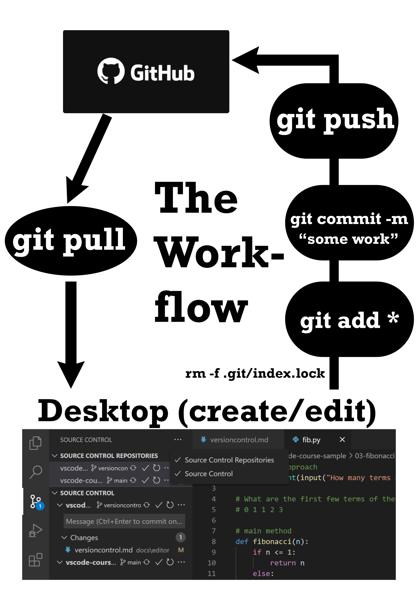

# Github and Git

  

    Table of contents
  

  {: .text-delta }
1. TOC
{:toc}

Git and Github were born in the mid 2000s.  [Git's history](https://www.linuxjournal.com/content/git-origin-story) started to help the linux development team manage open source code management. It has now become the defacto version control system on the planet. Within three years [Github started](https://nira.com/github-history/) and eventually was purchased by Microsoft for 7.5 billion dollars in Microsoft stock.

Both Git and Github have unique workflows and language that take some time to gain familiarity.  However, if you are going to call yourself a data scientist you should get comfortable using Github to collaborate on projects. We are using both to facilitate the following needs:

- Collaborate on coding projects and share our work for use by the world.
- Keep old versions of files indefinitely. Since all these versions are stored, we can always go back and see who modified the file and what changes they made. Or if we make a mistake in the future that breaks the program, we can revert back to an older version to fix it.
- Since we know who modified each file, if we have questions in the future we can go to that person with our questions.

## Git

Git can be used locally by you on a single computer to track changes in a project. You do not need to be connected to the internet to use Git. However if you want to share your work with a larger audience, the easiest solution is to host the repository on a web site for others to download and inspect.

### Installing Git

1. [Download git](https://git-scm.com/).
2. Install the software on your computer.
3. Git to work...

#### Windows notes

When asked about “Adjusting your PATH environment”, make sure to select “Git from the command line and also from 3rd-party software”. Otherwise, we believe it is good to accept the defaults.

#### Mac notes

If you are having problems installing Git, us [this guide](https://dougdefrank.wordpress.com/2019/06/07/git-with-vs-code-for-mac-part-2/).

### Configure git

Open the shell on your computer (terminal in VScode). From there, type the following commands (replace the relevant parts with your own information):

* `git config --global user.name 'hathawayj'`
    * This can be your full name, your username on GitHub, whatever you want. Each of your commits will be logged with this name, so make sure it is informative **for others**.
* `git config --global user.email 'hathawayj@byui.edu'`
    * **This should be the email address you used to register on GitHub.**

You will not see any output from these commands. To ensure the changes were made, run `git config --global --list`.

## Connecting to Github

Your Github username represents your business life as well as your personal life. [Github provides sound guidance](https://github.community/t/getting-started-with-github-part-1-best-practices-for-setting-up-your-github-account/10192) on setting up your account that I have plagiarized. Creating an account requires three things:

1. A unique username, or handle
2. An email address
3. A password

__Your name is important. It differentiates you from millions of other people. So too, is your GitHub handle.__ That might sound a little heavy, but, think about this: Your GitHub handle can be used to view your contributions to public projects hosted on GitHub. Your interactions with other people on GitHub are introduced with your avatar and handle. Selecting a handle that identifies you for the amazing person you are but can potentially survive the test of time can be hard. 

Be you! When selecting your handle, it is very important to be true to yourself and who you are as an individual. Keep in mind, you might be listing your handle on your resume in the future and recruiters might be contacting you because of the work you do on GitHub. Having a handle that doesn’t raise questions about your personality or how you mesh with different members of a team is a great way to gauge if you are selecting a great handle.

## The Git workflow

**Do this every time you finish a valuable chunk of work, at least once a day.**

1. At the prompt in the terminal type `git pull` and hit enter. This will bring any changes that you or others may have pushed to your Github repo down to your local machine. This is particularly helpful if you are working as a team on a larger project, or if you are accessing the Github repo from multiple computers (i.e. your work computer and your home computer). You may be asked to resolve conflicts if your local version conflicts with what is found in the repository.
2. Edit a file on your computer within your local repository.
3. Next type `git add .` and hit enter. The period means you are staging all the files in the Git pane. In the uncommon occurence that you only want to upload certain files you can specify them by name.
4. Next type `git commit -m "put a cutomized message here"` and hit enter. This batches the changes and will be something that git tracks. The `-m` stands for message. The customized message is not optional, it should describe the nature of the changes you have made.
5. Next type `git push` and hit enter. This officially pushes from your local machine to the Github repository.

Caution: Before you *push* your changes to GitHub, first you should *pull* from GitHub. Why? If you make changes to the repo in the browser or from another machine or (one day) a collaborator has pushed, you will be happier if you pull those changes in before you attempt to push.

Here is an image that illustrates the work flow commands that were just described.

## Managing your Github space

If you are trying to get a job, then your Github space should be organized.  Take the time to make this space your coding 'social media' where people see the best side of your work.

- Make your landing page stand out by [Managing your profile README](https://docs.github.com/en/github/setting-up-and-managing-your-github-profile/customizing-your-profile/managing-your-profile-readme). Use [this guide](https://daily.dev/blog/creating-a-killer-github-profile-readme-part-1) for additional inspiration.
- Track your work share it with the world.
- Organize and document your repositories. Here are some [great examples](https://github.com/matiassingers/awesome-readme)
- Find a project you could support (long term goal).

## References

I took quite a bit of material from the University of Chicago's [Computing for the Social Sciences](https://cfss.uchicago.edu/setup/what-is-git/).

