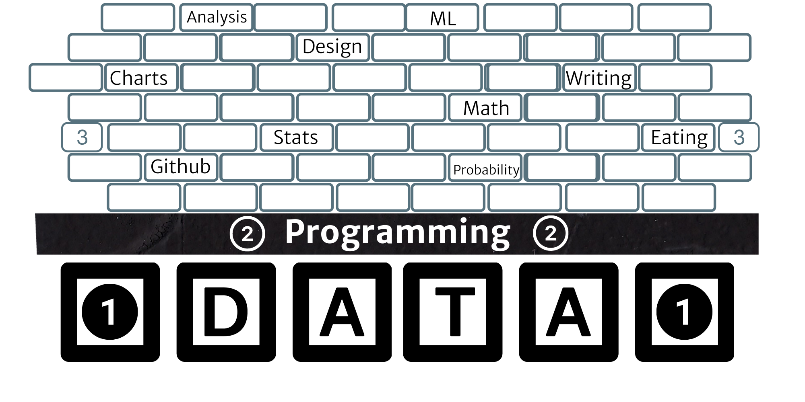

# Introduction

## My history

### My family

I know.  I have a lot of kids.  My oldest is 21, and my youngest is 4.

### My school/professional journey

1998: Start my undergraduate at BYU
2000: Transfer to the University of Utah
2003: Undergraduate in Economics (er [Socialist History](https://dailyutahchronicle.com/2018/04/16/us-economics-department-marxist-or-diverse/)) from the U.
2003-2005: Master’s degree in Statistics from BYU.
2005-2012: [Statistician: Pacific Northwest National Laboratory (PNNL)](https://www.pnnl.gov/computational-mathematics-statistics-0)
2012-2015: Reformed statistician: PNNL 
2015-Current: [Data Scientist: BYU-I](https://www.byui.edu/mathematics/student-resources/data-science)
2015-Current: Data-Driven Consulting (Medical records and Child Health Analytics, Environmental Sampling, Business Consulting)

### My data DNA

- Building energy data (real and [simulated](https://energyplus.net/))
- [Climate model data](https://climate.pnnl.gov/#) using Hadoop
- Rat trial data (smoking and cancer)
- [Bomb fragmentation](https://apps.dtic.mil/sti/pdfs/ADA531258.pdf)
- Lidar from retired World War II ranges
- Lidar from warehouse scans
- Spatial data with the power grid and climate models
- Power Grid data
- HR/Employment data
- Banking data
- University records data
- [Newborn and Child Health](https://www.gatesfoundation.org/our-work/programs/global-development/maternal-newborn-and-child-health)
- [Library records data](https://data.seattle.gov/Community/Library-Collection-Inventory/6vkj-f5xf)
- Movement data from SafeGraph
- [Electronic Health Records](https://www.optum.com/business/solutions/government/federal/data-analytics-federal/clinical-data.html)

### Questions

- _What things do you (not) like in the data science space?_
- _Why did you stop calling yourself a statistician?_
- _Why did you leave PNNL?_
- _What do(n't) you like about academia?_
- _What is your favorite music group?_
- _Why did you choose Kennesaw State for your sabbatical?_
- _Which data science programming language is your favorite?_
- _What are some jobs you had before you finished graduate school?_
- _How do you define 'big data?'_
- _What do you think about mathematics education?_
- _How does Kennesaw compare to Rexburg?_
- _How is BYU-I related to BYU and The Church of Jesus Christ of Latter-day Saints?_  

### Class introductions

- _Your major and plans after you graduate._
- _How long you have lived in Georgia._
- _Why you picked Kennesaw State for your education._

#### Anonymous note

1. _Why are you taking this class?_
2. _What would you like to remember from this class five years from now?_

## Data science programming

I see data engineering as ‘big client’ (building pipelines and tools that touch 1000's) with small daily change (refine systems and deliver quicker results) and data science as a small client (addressing the needs of 10's in management) with ‘big change’ and new modeling (propose the latest methods and demo the data munging and value).

A data engineer would spend more of their time talking with IT and CS folk.  They would interact heavily with the data scientists as well.  The data engineer would translate for the data scientist into the IT and CS space, and the data scientist would translate for the data engineer into the business and business need space. A data scientist would spend less of their time talking with IT and CS than a data engineer. Many people will wear the data science and data engineering hat at the same time.  

> Data Scientist (n.): Person who is better at statistics than any software engineer and better at software engineering than any statistician. [Josh Wills](https://twitter.com/josh_wills/status/198093512149958656?s=20)

The Darkside of that quote is real!  Data scientists don't program as well as software engineers.  Data scientists are also reasonably soft when it comes to understanding the larger field of statistical analysis. We can improve over time. However, our domain structure often demands that we don't specialize in the technical areas as we are often scaling up in other domains. If we did specialize, then we would be called statisticians or software engineers.

## Where are we going?

Everything in this class starts with data.  We need programming to handle data.  After data and programming, all other skills are a distant third.  I want to help you have a solid foundation and introduce you to the different abilities of data science.

### Class structure

Let's look at [the syllabus](../README.md) and make sure we understand the plan.

- [Objectives](../README.md#course-objectives)
- [Teaching DS principles](../README.md#principles-of-data-science-teaching)
- [Course communication](../README.md#course-communication)
- [Projects](../README.md#project-topics)
- [Tri-weekly routine](../README.md#course-outline)
- [Readings](../README.md#course-readings)
- [Course grading](../README.md#course-grading)

## Why are we doing this?

[Data Science job growth and employment are strong](https://lambdaschool.com/the-commons/data-science-job-growth-in-2021-and-beyond).  Even for skilled undergraduates.  We have had 0ver 50 graduates from BYU-I over the last three years, and almost all have found and maintained employment in analytics.  The students that can't program well and do poorly in school are still demanding ~$50k a year.  The better programmers and performers in schools are starting in the high $70k range.  

## On teaching and learning

<iframe width="560" height="315" src="https://www.youtube.com/embed/kO8x8eoU3L4" title="YouTube video player" frameborder="0" allow="accelerometer; autoplay; clipboard-write; encrypted-media; gyroscope; picture-in-picture" allowfullscreen></iframe>

- Can you read the few quotes under each heading of my [learning manifesto](https://datathink.io/my-learning-manifesto-aka-teaching-philosophy/) and pick your favorite?

## What is next?

On Wednesday, we will help everyone finalize their installation and computer setup.  Please review the [guides](../guides/readme.md) on slack, VScode, and Git before class.  I would even try to get everything installed and working.

### Connecting to Slack

[Join ksuds.slack.com](https://join.slack.com/t/ksuds/signup) with your `kennesaw.edu` email to connect with our class workspace. Slack has a set of [videos](https://slack.com/help/articles/360059976673-Slack-video-tutorials) that can help you get comfortable with the tool. You can also use the [quick start guide](https://slack.com/help/articles/360059928654-How-to-use-Slack--your-quick-start-guide) to familiarize yourself.

I highly recommend the apps over the web interface. Please [download](https://slack.com/downloads/) them for your phone and computer.

