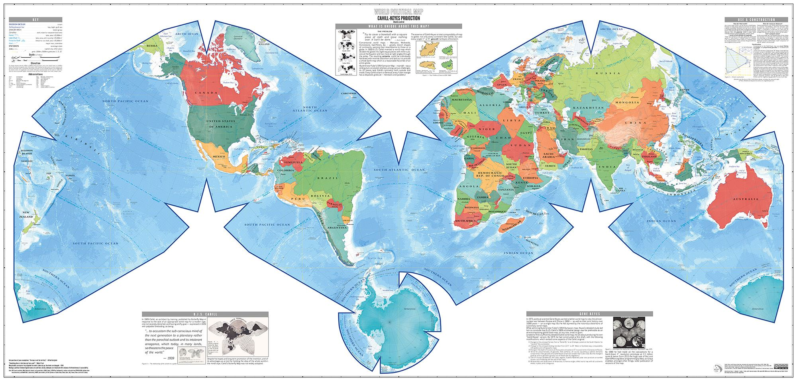
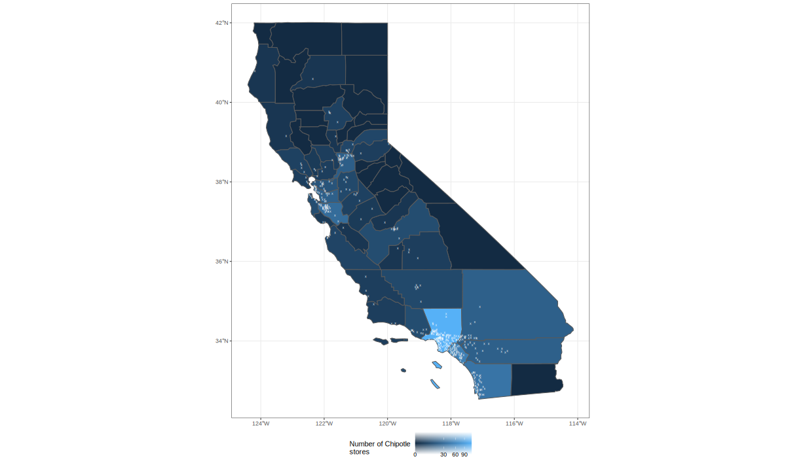

# P3D3: Programming with spatial data

_These slides map to the R example slides on [Day 23 or P3D9](d23.md)_


> __GESTALT:__ AN ORGANIZED WHOLE THAT IS PERCEIVED AS MORE THAN THE SUM OF ITS PARTS

## [Andrew Gelman on spatial data](http://www.stat.columbia.edu/~gelman/research/published/allmaps.pdf)

> Mapping raw data can lead to spurious spatial features. For example, regions can appear highly variable because of small sample sizes in spatial sub-units (as in the radon example) or small populations (as in [the cancer example](https://cdn.cnn.com/cnnnext/dam/assets/170124123712-01-cancer-cluster-maps--exlarge-169.jpg)), and these apparently variable regions contain a disproportionate number of very high (or low) observed parameter values
>
> Furthermore, maps really do make convenient look-up tables (what is the cancer rate, or mean radon level, in my county?). Unfortunately, even maps that are intended to be used only as look-up tables are almost sure to be used for identifying spatial features – we find it very hard to suppress this instinct ourselves
> [ref](http://www.stat.columbia.edu/~gelman/research/published/allmaps.pdf)

- [SF package](https://r-spatial.github.io/sf/index.html)
- [USAboundaries package](https://docs.ropensci.org/USAboundaries/index.html)
- [Leaflet package](https://rstudio.github.io/leaflet/)
- __[Spatial Data Science: with applications in R](https://keen-swartz-3146c4.netlify.app/)__

## Understanding spatial references

__WHICH AREA IS LARGER - THE CONTINENTAL 48 STATES OR THE COUNTRY OF BRAZIL?__   

- [https://spatialreference.org/ref/](https://spatialreference.org/ref/)
- [Boston has decided to change their projections used in school](https://www.theguardian.com/education/2017/mar/19/boston-public-schools-world-map-mercator-peters-projection)
- [Let's watch a video referenced the Guardian article](https://www.youtube.com/watch?v=vVX-PrBRtTY&t=239s)




[Nice video on cahill-keys](https://www.youtube.com/watch?v=sD7ED12XGFo)

## Leveraging the SF package

All functions in the `sf` and `stars` packages that operate on simple feature objects start with `st_` which stands for spatial type.

### Getting lat and long columns to spatial objects

You can pipe the data into this function to convert from ordinary text columns to an `SF` geometry. Note the `crs` and `coords` arguments.

- [st_as_sf](https://r-spatial.github.io/sf/reference/st_as_sf.html) 

```r
st_as_sf(coords = c("longitude", "latitude"), crs = 4326)
```

### Practicing with polygons and points

The `USAboundaries` package makes it very easy for us to leverage polygons for US political boundaries.

```r
install.packages("USAboundaries")
install.packages("USAboundariesData", repos = "http://packages.ropensci.org", type = "source")
```

```r
cal <- us_counties(states = "California") %>%
    select(countyfp, countyns, name, aland, awater, state_abbr, geometry)
```

Let's plot our polygons

```r
ggplot(data = cal) +
    geom_sf(aes(fill = awater)) + 
    geom_sf_text(aes(label = name), color = "lightgrey") +
    theme_bw() +
    labs(fill = "Area of county\ncovered by water", title = "What are the units?")
```

#### Calculating areas

- What units are the `awater` and `aland` variables in?
- Does `aland` include `awater`?

- [st_area](https://r-spatial.github.io/sf/reference/geos_measures.html)

#### Counting Chipotle stores by county

- [st_join()](https://r-spatial.github.io/sf/reference/st_join.html)
- [st_within()](https://r-spatial.github.io/sf/reference/geos_binary_pred.html)
- [Great reference](https://mattherman.info/blog/point-in-poly/)
#### Plotting with ggplot2

Let's create this chart in ggplot2.



#### Plotting with leaflet

```r
# need to define calw
bins <- c(0, 10, 20, 30, 50, 70, 90, 110)
pal <- colorBin("YlOrRd", domain = calw$n)

m <- leaflet(calw) %>%
    addPolygons(
        data = calw,
        fillColor = ~pal(n),
        fillOpacity = .5,
        color = "darkgrey",
        weight = 2) %>%
    addCircleMarkers(
        data = filter(dat, region == "CA"),
        radius = 3,
        color = "grey") %>%
    addProviderTiles(providers$CartoDB.Positron)
```