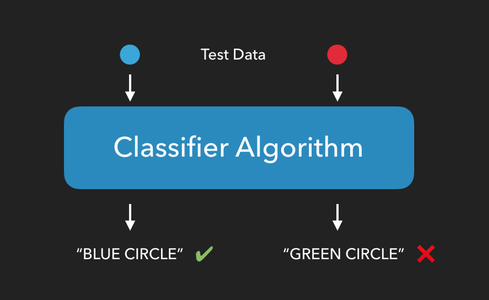

# P4D1: Understanding the Pavlov in Machine Learning

> AI is able to learn 'rules' from highly repetitive data.
>
> The single most important thing for AI to accomplish in the next ten years is to free us from the burden of repetitive work. [Sebastian Thrun](https://www.youtube.com/watch?v=ZJixNvx9BAc)

You might enjoy the [Machine Learning: Living in the Age of AI : A WIRED Film](https://www.youtube.com/watch?v=ZJixNvx9BAc).

- [Pavlov's Dogs](https://www.youtube.com/embed/asmXyJaXBC8)
- [Conformity Experiment](https://www.youtube.com/embed/TrTk6DsEJ2Q)

##  Understanding Machine Learning (Classification)

__As we review [A visual introduction to machine learning](http://www.r2d3.us/visual-intro-to-machine-learning-part-1/), be prepared to address the following questions;__

- What is the difference between a feature and a target?
- What does it mean to classify?
- What does it mean to create a machine learning model?
- What does it mean to find _'boundaries'_ in our variables or features?
- How does finding _'boundaries'_ help us in ML?
- What are false positives?
- What are false negatives?
- What is accuracy?
- What is training data?
- What is test data?

> Machine learning identifies patterns using statistical learning and computers by unearthing boundaries in data sets. You can use it to make predictions.
>
> One method for making predictions is called a decision trees, which uses a series of if-then statements to identify boundaries and define patterns in the data.
>
> Overfitting happens when some boundaries are based on distinctions that don’t make a difference. You can see if a model overfits by having test data flow through the model.
>
> [A visual introduction to machine learning](http://www.r2d3.us/visual-intro-to-machine-learning-part-1/)

__As we review [Model Tuning and
the Bias-Variance Tradeoff](http://www.r2d3.us/visual-intro-to-machine-learning-part-2/), be prepared to address the following questions;__

- What is bias?
- What is variance?
- What does the ‘minimum node size’ impact?

> The bias error is an error from erroneous assumptions in the learning algorithm. High bias can cause an algorithm to miss the relevant relations between features and target outputs (underfitting).
>
> The variance is an error from sensitivity to small fluctuations in the training set. High variance may result from an algorithm modeling the random noise in the training data (overfitting).
>
> 1. Models approximate real-life situations using limited data.
>
> 2. In doing so, errors can arise due to assumptions that are overly simple (bias) or overly complex (variance).
>
> 3. Building models is about making sure there’s a balance between the two.

__As we review [Tensorflow's Neural Network playground](https://playground.tensorflow.org/#activation=tanh&batchSize=10&dataset=circle&regDataset=reg-plane&learningRate=0.03&regularizationRate=0&noise=0&networkShape=4,2&seed=0.86695&showTestData=false&discretize=false&percTrainData=50&x=true&y=true&xTimesY=false&xSquared=false&ySquared=false&cosX=false&sinX=false&cosY=false&sinY=false&collectStats=false&problem=classification&initZero=false&hideText=false&dataset_hide=false), be prepared to address the following questions;__

- What do the FEATURES represent?
- Can we tackle [Google's questions](https://developers.google.com/machine-learning/crash-course/introduction-to-neural-networks/playground-exercises)?

## Reviewing the reward/penalty in Machine Learning

_What is the ‘Pavlovian bell’ in the machine learning model?_



### ML Newbie mistakes

1. If your model is near perfect in predicting, then you are probably cheating (at least for early stage and most problems).
2. Watch out for [transactional data](https://www.sciencedirect.com/topics/computer-science/transactional-data)
3. Forgetting the importance of [feature engineering](https://machinelearningmastery.com/discover-feature-engineering-how-to-engineer-features-and-how-to-get-good-at-it/).
4. Not simplifying and explaining the model.

## Packages for ML in Python

[scikit-learn](https://scikit-learn.org/stable/) is the Python package for machine learning.

### Install the one package to rule them all

```python
import sys
!{sys.executable} -m pip install scikit-learn
```

- __The Mac M1 chips have some issues.  See the latest info on the [Github issue](https://github.com/scikit-learn/scikit-learn/issues/19137).__
- __scikit-learn's [details](https://scikit-learn.org/stable/install.html#installing-on-apple-silicon-m1-hardware)__


### Should I import scikit-learn?

scikit-learn is very large, with many [submodules](https://scikit-learn.org/stable/user_guide.html). To help the user of your `.py` script understand your code, the consensus is to use `from .... import ....`.


```python
from sklearn.model_selection import train_test_split
from sklearn import tree
from sklearn.naive_bayes import GaussianNB
from sklearn import metrics
```