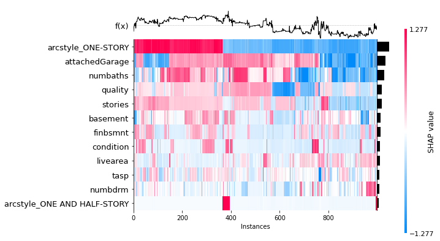

# P4D3: From scikit-learn to DALEX/SHAP

- [scikit-learn](https://scikit-learn.org/stable/)
- [Dalex](https://dalex.drwhy.ai/python/api/)
- [SHAP](https://shap.readthedocs.io/en/latest/index.html)

## Installation

```python
import sys
!{sys.executable} -m pip install scikit-learn dalex shap
```
https://ema.drwhy.ai/figure/mdp_general.png

## Building our model

After building our machine learning data (`dat_ml.pkl`), we can start our `model.py` script.

```python
# %%
import pandas as pd
import numpy as np
import joblib # to savel ml models
from plotnine import *

from sklearn import metrics

from sklearn.model_selection import train_test_split
from sklearn import tree
from sklearn.naive_bayes import GaussianNB
from sklearn.ensemble import GradientBoostingClassifier
```

### Build training and testing data

```python
# %%
dat_ml = pd.read_pickle('dat_ml.pkl')
# Split our data into training and testing sets.
X_pred = dat_ml.drop(['yrbuilt', 'before1980'], axis = 1)
y_pred = dat_ml.before1980
X_train, X_test, y_train, y_test = train_test_split(
    X_pred, y_pred, test_size = .34, random_state = 76)  
```

### Building our models

```python
clfNB = GaussianNB()
clfGB = GradientBoostingClassifier()
clfNB.fit(X_train, y_train)
clfGB.fit(X_train, y_train)
ypred_clfNB = clfNB.predict(X_test)
ypred_clfGB = clfGB.predict(X_test)
```

### Diagnosing our model with sklearn

```python
# %%
metrics.plot_roc_curve(clfGB, X_test, y_test)
metrics.plot_roc_curve(clfNB, X_test, y_test)
# %%
metrics.confusion_matrix(y_test, ypred_clfNB)
metrics.confusion_matrix(y_test, ypred_clfGB)
```

__Now we can build our own feature importance chart.__

```python
# %%
df_features = pd.DataFrame(
    {'f_names': X_train.columns, 
    'f_values': clfGB.feature_importances_}).sort_values('f_values', ascending = False).head(12)

# Python sequence slice addresses 
# can be written as a[start:end:step]
# and any of start, stop or end can be dropped.
# a[::-1] is reverse sequence.
f_names_cat = pd.Categorical(
    df_features.f_names,
    categories=df_features.f_names[::-1])

df_features = df_features.assign(f_cat = f_names_cat)

(ggplot(df_features,
    aes(x = 'f_cat', y = 'f_values')) +
    geom_col() +
    coord_flip() +
    theme_bw()
    )
```

### Finalizing our model

__We have ignored model tuning beyond variable reduction.__ You would want to tune your model parameters and evaluate your classification threshold as well.

__Variable reduction__

```python
# build reduced model
compVars = df_features.f_names[::-1].tolist()

X_pred_reduced = dat_ml.filter(compVars, axis = 1)
y_pred = dat_ml.before1980

X_train_reduced, X_test_reduced, y_train, y_test = train_test_split(
    X_pred_reduced, y_pred, test_size = .34, random_state = 76)  

clfGB_reduced = GradientBoostingClassifier()
clfGB_reduced.fit(X_train_reduced, y_train)
ypred_clfGB_red = clfGB_reduced.predict(X_test_reduced)

# %%
print(metrics.classification_report(ypred_clfGB_red, y_test))
metrics.confusion_matrix(y_test, ypred_clfGB_red)

```

### Saving our models

```python
# %%
joblib.dump(clfNB, 'models/clfNB.pkl')
joblib.dump(clfGB, 'models/clfGB.pkl')
joblib.dump(clfGB_reduced, 'models/clfGB_final.pkl')
df_features.f_names[::-1].to_pickle('models/compVars.pkl')
```

## Explaining our model

__[Explanatory Model Analysis
Explore, Explain, and Examine Predictive Models. With examples in R and Python.](https://ema.drwhy.ai/)__

_Let's create a new `explain.py` script for our model explanation.

```python
# %%
import pandas as pd
import numpy as np
import dalex as dx
import matplotlib.pyplot as plt

import shap
import joblib

from dalex._explainer.yhat import yhat_proba_default
from sklearn.model_selection import train_test_split


# %%
# load models and data
clfNB = joblib.load('models/clfNB.pkl')
clfGB = joblib.load('models/clfGB.pkl')
clfGB_reduced = joblib.load('models/clfGB_final.pkl')
compVars = pd.read_pickle('models/compVars.pkl').tolist()
dat_ml = pd.read_pickle('dat_ml.pkl')
y_pred = dat_ml.before1980
X_pred = dat_ml.drop(['yrbuilt', 'before1980'], axis = 1)
X_pred_reduced = dat_ml.filter(compVars, axis = 1)

X_train, X_test, y_train, y_test = train_test_split(
    X_pred, y_pred, test_size = .34, random_state = 76) 
# may not be the most efficient way to do this
X_train_reduced, X_test_reduced, y_train, y_test = train_test_split(
    X_pred_reduced, y_pred, test_size = .34, random_state = 76)  
```

### Using DALEX

- [Partial-dependence profiles](https://ema.drwhy.ai/partialDependenceProfiles.html)
- [Accumulated-local Profiles](https://ema.drwhy.ai/accumulatedLocalProfiles.html)

```python
# %%
# Create explainer objects and show variable importance chart
expReduced = dx.Explainer(clfGB_reduced, X_test_reduced, y_test)
explanationReduced = expReduced.model_parts()
explanationReduced.plot(max_vars=15)

# %%
# show model performance
mpReduced = expReduced.model_performance(model_type = 'classification')
print(mpReduced.result)
mpReduced.plot(geom="roc")

# %%
# Explain variables
pdp_num_red = expReduced.model_profile(type = 'partial', label="pdp", variables = compVars)
ale_num_red = expReduced.model_profile(type = 'accumulated', label="ale", variables = compVars)
pdp_num_red.plot(ale_num_red)

# %%
# Explain observation
# shapley values
sh = expReduced.predict_parts(X_test_reduced.iloc[0,:], type='shap', label="first observation")

sh.plot(max_vars=12)

```

### Using SHAP

- [Original paper](https://arxiv.org/pdf/1705.07874.pdf)
- [Detailed Example in Nature](https://www.nature.com/articles/s41551-018-0304-0.epdf?author_access_token=vSPt7ryUfdSCv4qcyeEuCdRgN0jAjWel9jnR3ZoTv0PdqacSN9qNY_fC0jWkIQUd0L2zaj3bbIQEdrTqCczGWv2brU5rTJPxyss1N4yTIHpnSv5_nBVJoUbvejyvvjrGTb2odwWKT2Bfvl0ExQKhZw%3D%3D)
- [bar](https://shap.readthedocs.io/en/latest/example_notebooks/api_examples/plots/bar.html)
- [beeswarm](https://shap.readthedocs.io/en/latest/example_notebooks/api_examples/plots/beeswarm.html)
- [heatmap](https://shap.readthedocs.io/en/latest/example_notebooks/api_examples/plots/heatmap.html)
- [partial](https://shap.readthedocs.io/en/latest/example_notebooks/overviews/An%20introduction%20to%20explainable%20AI%20with%20Shapley%20values.html#Reading-SHAP-values-from-partial-dependence-plots)

```python
# %%
# Build shap explainer
explainerShap = shap.Explainer(clfGB_reduced)
shap_values = explainerShap(X_test_reduced)

# %%
# Show variable importance based on shap values
shap.plots.bar(shap_values)

# %%
# https://medium.com/dataman-in-ai/the-shap-with-more-elegant-charts-bc3e73fa1c0c
shap.plots.beeswarm(shap_values)

# %%
# comparable to the bar plot
shap.plots.beeswarm(shap_values.abs, color="shap_red")

# %%
# combine the above charts
shap.plots.heatmap(shap_values[0:1000],  max_display=13)
```



_We can also use partial dependence plots._

```python
# %%
shap.plots.partial_dependence(
    "numbaths", 
    clfGB_reduced.predict,
    X_test_reduced,
    ice=False,
    model_expected_value=True,
    feature_expected_value=True)

# %%
shap.plots.partial_dependence(
    "livearea", 
    clfGB_reduced.predict,
    X_test_reduced,
    ice=False,
    model_expected_value=True,
    feature_expected_value=True, 
    show=False)

plt.xlim(xmin=0,xmax=15000)
plt.show()
```