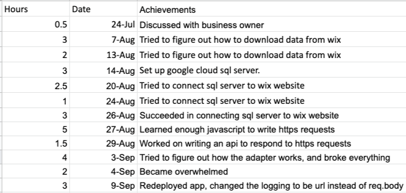

## P1D4: Python for data science

### Visualization discussion ([Effectively Communicating Numbers](http://perceptualedge.com/articles/Whitepapers/Communicating_Numbers.pdf))

> To be truthful and revealing, data graphics must bear on the question at the heart of quantitative thinking: “Compared to what?” The emaciated, data-thin design should always provoke suspicion, for graphics often lie by omission, leaving out data sufficient for comparisons. 
> [Edward Tufte](https://medium.com/@AnyChart/advices-by-edward-tufte-importance-of-context-for-charts-819396300255)

> Remember to follow this process for graph selection and design in order to communicate your information in the most
effective manner:
> - Determine your message and identify your data
> - Determine if a table, graph, or combination of both is needed to communicate your message
> - Determine the best means to encode the values
> - Determine where to display each variable
> - Determine the best design for the remaining objects
> - Determine if particular data should be featured, and if so, how

### Learning code discussion

__Why does this feel hard?__

_Because learning new tools is almost always confusing. I want to make sure you don’t drown, but I also don’t want you to think that you get a floaty for the rest of your life._



### Making sure our we have our Python packages

#### installing the key packages

For _'small'_ data work these are my primary packages.

```python
import sys
!{sys.executable} -m pip install numpy pandas scikit-learn plotnine altair 
```

- [numpy](https://numpy.org/): We will not get into the science of this package.  We will just use a few elements.  Pandas uses it heavily.
- [pandas](https://pandas.pydata.org/docs/) is the center of the universe for data in Python.  We will use it heavily.
- [scikit-learn](https://scikit-learn.org/stable/) and pandas define the center of the universe for data science.
- [plotnine](https://plotnine.readthedocs.io/en/stable/) is a port of ggplot2 to Python.
- [Altair](https://altair-viz.github.io/) is a great declarative visualization package connected to Vega/VegaLite/D3.

```python
import sys
!{sys.executable} -m pip install --upgrade pip
```

#### Why are we not using Anaconda

Because VS Code fixed all the problems that I have historically had with pip. Additionally, we are not getting too deep into scientific computing.


#### Why are we not using Jupyter notebooks

1. If we hope to have our code work in a production environment then Jupyter is problematic.
2. Caching and code chunks are problematic. 

_Read this [reference](https://medium.com/skyline-ai/jupyter-notebook-is-the-cancer-of-ml-engineering-70b98685ee71) for more details._

#### If we have plotnine, why are we using Altair?

- It uses a clean grammar of graphics that gives us access to interactive charts and web charts ( [What is Altair?](https://www.youtube.com/watch?v=AAuPPorsmJc)). It feels more Pythonic. 


#### My Python disclaimers

__What are we not learning in this course?__

- __Indexing, `.loc[]`, and `.iloc[]`__: I may not be experienced enough to understand why I should teach you these. I think they all add complexity to what we are learning in the course and we have elected to avoid it. We will use `reset_index()` a lot. I think [MultiIndex](https://towardsdatascience.com/how-to-use-multiindex-in-pandas-to-level-up-your-analysis-aeac7f451fce) features create complication. I have also elected to use `.filter()` instead of `.loc[]` because I like it.
- __Virtual Environments__: [Virtual Environments](https://towardsdatascience.com/virtual-environments-for-data-science-running-python-and-jupyter-with-pipenv-c6cb6c44a405#:~:text=The%20primary%20purpose%20of%20Python,dependencies%20every%20other%20project%20has.) appear to be an important tool as you continue to use Python. We will not be teaching these or supporting these in our course.
- __matplotlib (and most derivatives)__: It feels old, [has a bad api](https://ryxcommar.com/2020/04/11/why-you-hate-matplotlib/), and isn’t declarative. Note that Plotnine is based on matplotlib.  However, it hides most of the problems of matplotlib to the average user.

__

### Our first `pandas` code

#### Setting up our script

```python
import pandas as pd
import numpy as np
import altair as alt
from plotnine import *
```

#### Getting our data

```python
df = pd.DataFrame(
{"a" : [4 ,5, 6],
"b" : [7, 8, 9],
"c" : [10, 11, 12]})

url = 'https://github.com/byuidatascience/data4soils/raw/master/data-raw/cfbp_handgrenade/cfbp_handgrenade.csv'
dat = pd.read_csv(url)
```
#### Writing code

> [Pandas Cheat Sheet](https://pandas.pydata.org/Pandas_Cheat_Sheet.pdf)

__Use the cheat sheet to find the functions you would need to implement the following steps.__

_I want to;_    

1. sort my table by column a then
1. only use the first 2 rows then
1. calculate the mean of column b.

_I want to;_    

1. rename column a to duck then
1. subset to only have duck and b columns then
1. keep all rows where b is less than 9 then
1. find the min of duck

#### What is method chaining?

It is Pandas and Altair comparable tool to `%>%` and dplyr's verbs.  It has the same flow and logic as the tidyverse.  You can read [more details from Adiamman Keerthi](https://towardsdatascience.com/the-unreasonable-effectiveness-of-method-chaining-in-pandas-15c2109e3c69#:~:text=Pandas%20provide%20several%20functions%20for,chemical%20composition%20for%20178%20wines.)

__Nested Calls__

```
tumble_after(
  broke(
    fell_down(
      fetch(went_up(jack_jill, "hill"), "water"),
            jack),
      "crown"),
    "jill"
)
```

__Method Chaining__

```
(
jack_jill
  .went_up("hill")
  .fetch("water")
  .fell_down("jack")
  .broke("crown")
  .tumble_after("jill")
)
```

> One obvious advantage of Method chaining is that it is a top-down approach with arguments placed next to the function unlike the nested calls, where tracking down respective function calls to its arguments is demanding.

__What do you notice about the method chaining code above?__

#### Using pandas to build our continent level data

_You can see mappings to `dplyr` in the [Python for Data Science book](https://byuidatascience.github.io/python4ds/transform.html#pandas-data-manipulation-basics)_

- [`.assign()`](https://pandas.pydata.org/docs/reference/api/pandas.DataFrame.assign.html)
- [`.groupby()`](https://pandas.pydata.org/docs/reference/api/pandas.DataFrame.groupby.html)
- [`.agg()`](https://pandas.pydata.org/docs/reference/api/pandas.DataFrame.agg.html)
- [`.reset_index()`](https://pandas.pydata.org/pandas-docs/dev/reference/api/pandas.DataFrame.reset_index.html)
- [`.assign()`](https://pandas.pydata.org/docs/reference/api/pandas.DataFrame.assign.html)
- [`np.average()`](https://numpy.org/doc/stable/reference/generated/numpy.average.html)
