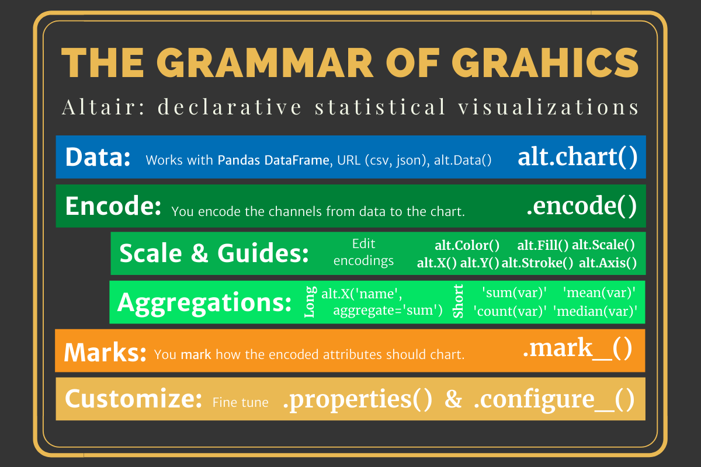

## P1D6: Open programming time for Python

### First principles weighted mean

1. Let's talk about [lambda functions](https://www.w3schools.com/python/python_lambda.asp)
2. Why we want to use them with `df.assign()`
3. Working through a groupby

### Plotnine's port of ggplot2

_What are the key differences you have noted between ggplot2 and plotnine?_

- Quoting table columns
- `.save()` method versus the `ggsave()` function.

### Questions about Altair

- [`alt.Chart()`](https://altair-viz.github.io/user_guide/generated/toplevel/altair.Chart.html) and [the introduction](https://altair-viz.github.io/getting_started/starting.html#the-chart-object)
- [`alt.X()`](https://altair-viz.github.io/user_guide/generated/channels/altair.Y.html)
- [`alt.Y()`](https://altair-viz.github.io/user_guide/generated/channels/altair.X.html)
- [`alt.Scale()`](https://altair-viz.github.io/user_guide/generated/core/altair.Scale.html)
- [`alt.Axis()`](https://altair-viz.github.io/user_guide/customization.html#adjusting-axis-limits)
- [`alt.Size()`](https://altair-viz.github.io/user_guide/generated/channels/altair.Size.html)
- [`alt.Column()`](https://altair-viz.github.io/user_guide/generated/channels/altair.Column.html)
- [`alt.layer()`](https://altair-viz.github.io/user_guide/compound_charts.html#layered-charts)
#### `alt.Chart()` methods

[`alt.Chart()`](https://altair-viz.github.io/user_guide/generated/toplevel/altair.Chart.html) and [the introduction](https://altair-viz.github.io/getting_started/starting.html#the-chart-object)

- [`.encode()`](https://altair-viz.github.io/user_guide/encoding.html)
- [`mark_<type>()`](https://altair-viz.github.io/user_guide/marks.html)
- [`.properties()`](https://altair-viz.github.io/user_guide/customization.html#adjusting-chart-size)
- [`.facet()`](https://altair-viz.github.io/user_guide/compound_charts.html#faceted-charts)
- [.configure_header()`](https://altair-viz.github.io/user_guide/configuration.html#header-configuration) and [the other configures](https://altair-viz.github.io/user_guide/configuration.html#top-level-chart-configuration)



Note that Altair defaults to placing commas at the thousands.  We can fix that with `alt.Axis(format='.0f')`

#### You can only use one data object

You can't facet with multiple data sets.  So, we need to get our continent data into our country DataFrame.

- I create a new `continent_color` column.
- Make sure the columns are identically named.
- In `cont_facet` I create a `country` column with `'Continent'` repeated. This will help in the `detail` argument of `.mark_line()`.
- In `cont_facet` then create a `"Continent"` value in the `continent_color` column.  This will allow me to mark it on the legend as the continent average in black.
- Then we leverage the `.append()` method from Pandas.

```python
count_facet = (gapminder
    .filter(['country', 'continent', 'year',
    'pop', 'gdpPercap', 'pop100k'], axis=1)
    .assign(continent_color = lambda x: x.continent)
)
cont_facet = (gm_con
    .filter(['continent', 'year', 'sum_pop', 
        'gdpPercap', 'pop100k'], axis=1)
    .rename({'sum_pop':'pop'},
        axis='columns')
    .assign(
        country = "Continent",
        continent_color = "Continent" 
         )
)

dat_facet = count_facet.append(cont_facet)
```
